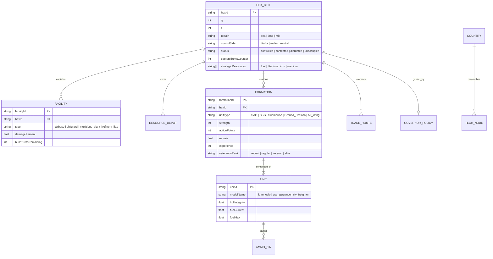
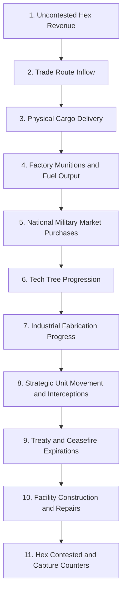

# Sea Power Theater Command: System Architecture & Data Model

## 1. Domain Data Schema

### 1.1 Hex Cell State and Physical Depots

- **Terrain**: `sea` | `land` | `mix` (with polygon GIS land-detection).
- **Control State**: `controlled` | `contested` | `disrupted` | `unoccupied`.
- **Capture Counter**: Integer from `0` to `5` turns.
  - Friendly ground/naval units present without opposing forces increment counter by +1 per turn.
  - Reaching 5 turns transfers hex ownership and remaining depot stockpiles to the occupying faction.
  - Contested battles freeze resource generation and extraction for all parties.
- **Physical Depots**:
  - `fuelStockpile`: Barrels stored in local refineries/depots (subject to bombing or capture).
  - `munitionsStockpile`: Missile bins (ASMs, SAMs), torpedoes, and shells stored locally.
  - `strategicMinerals`: Titanium, Iron, and Uranium extraction nodes.

### 1.2 Persistent Formation and Unit Schema

- **Formations**:
  - `formationId`, `side`, `countryId`, `hexId`, `strength`, `actionPoints`.
  - `morale` (0-100%), `experience` (0-100), `veterancyRank` (`recruit`, `regular`, `veteran`, `elite`).
- **Component Health and Weapon Bins**:
  - `hullIntegrity` (0-100%), `propulsionIntegrity`, `radarIntegrity`, `weaponBins`.
  - Permanent loss for sunk vessels.

## 2. The 11-Phase Simultaneous Turn Engine

1. **Uncontested Hex Revenue**: Tally income from all owned, non-contested hexes into national treasury.
2. **Trade Routes Inflow**: Tally trade route revenue for unblockaded sea and land lanes.
3. **Physical Cargo Delivery**: Advance cargo convoys carrying raw minerals and industrial components.
4. **Factory Production**: Munitions plants and refineries convert stockpiles into missile/torpedo batches and fuel.
5. **National Military Market**: Process delivery of foreign or surplus asset acquisitions.
6. **Tech Tree Research**: Progress active research nodes based on laboratory capacity.
7. **Industrial Fabrication**: Advance build queues for domestic shipyards and airframe plants.
8. **Strategic Movement**: Move formations along plotted routes, consuming AP and fuel; trigger interception encounters.
9. **Diplomatic Treaties**: Decrement turn-bound treaties (ceasefires, tributes, non-aggression pacts).
10. **Infrastructure Construction**: Progress construction and repairs of airbases, radar sites, and depots.
11. **Capture and Contested Counter**: Update hex occupation counters (triggering capture upon reaching 5 turns).
