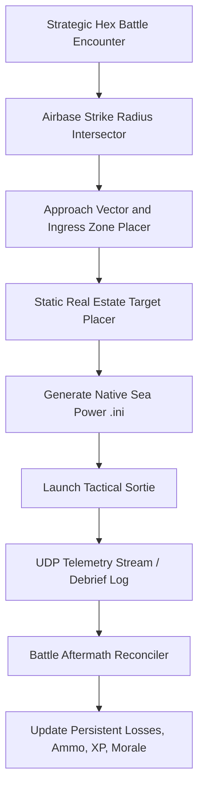

# Sea Power Tactical Mission Generation & Telemetry Architecture

## 1. Tactical Bridge Overview

The Tactical Bridge compiles strategic state into a native Sea Power mission `.ini` file and reconciles post-battle outcomes back into persistent campaign storage.

## 2. Ingress & Egress Geometry

- **Dynamic Ingress Vectors**: Calculates the compass bearing from the attacking formation hex to the defending hex, placing initial spawn `[Zone]` objects along the respective map boundary (e.g. South-West ingress zone).
- **Airbase Strike Radius Inclusion**:
  - Scans friendly airbases within operational range $R$ (e.g. 350 nm for strike fighters, 600 nm for naval bombers).
  - Presents available squadrons in the sortie planner UI.
- **Safe Egress Zones**:
  - Land-based aircraft without carrier deck landing capabilities are assigned egress waypoints that despawn safely without casualties upon mission completion.

## 3. Post-Battle State Reconciliation

- **UDP Telemetry Listener**:
  - Subscribes to Sea Power runtime event stream on local UDP port.
  - Captures unit destruction, weapon release events, and damage state in real time.
- **Save Debrief Log Fallback**:
  - Parses post-mission debriefing logs to extract final hull health, torpedoes/missiles remaining, and enemy losses.
- **Persistent Campaign Updates**:
  - Sunken units marked permanently destroyed.
  - Expended ammo bins subtracted from formation stockpile.
  - Surviving units receive experience points (+10 to +25 XP) and veterancy rank updates.
  - Crew morale adjusted based on tactical victory or defeat.
