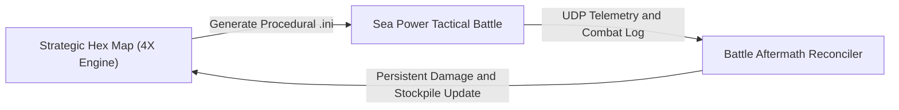

# Product Requirements Document (PRD): Cold War Theater Command

## 1. Executive Summary & Vision

**Theater Command** is an open, extensible Cold War Grand Strategy 4X and Tactical MILSIM bridge. It combines strategic theater management—moving armies, physical supply logistics, industrial production, diplomatic treaties, and technological research on a worldwide hex grid—with tactical battle resolution inside **Sea Power: Naval Combat in the Missile Age** (and future MILSIMs like DCS).

## 2. Core Pillars

### 2.1 4X Grand Strategy and Worldwide Hex Grid

- **Global Data Schema**: The entire planet is modeled as a unified discrete hexagonal grid with realistic GIS land, sea, and coastal terrain.
- **Sector Operations**: Regional scenarios (e.g. Northern Flank / Norwegian Sea, Baltic Fire, GIUK Gap, Persian Gulf) focus on high-density active sectors while retaining full global interoperability.
- **Dynamic Sandbox**: No scripted narrative rails. Factions act and react dynamically based on doctrine, resources, and threat proximity.

### 2.2 True Persistent Asset and Component Logistics

- **Permanent Destruction**: Sunken vessels and destroyed airframes are permanently removed from the campaign ledger.
- **Physical Ammunition and Fuel Depots**: Missiles (ASMs, SAMs), torpedoes, and naval fuel are physically stored in hex facilities. Expended ammo must be produced by factories and transported via supply lines.
- **5-Turn Capture and Contested Mechanics**: A hex changes ownership after 5 uncontested turns of friendly ground/naval presence. Inconclusive combat locks the hex into a Contested status, freezing resource extraction for all parties.

### 2.3 Tactical MILSIM Bridge

- **Realistic Ingress Vectors**: Forces spawn on boundary zones corresponding to their strategic approach vector (e.g. SW approach spawns on SW map edge).
- **Airbase Radius Inclusion**: Friendly airbases within operational combat radius contribute strike wings and CAP escorts to nearby hex battles.
- **Safe Egress Zones**: Land-based aircraft without carrier deck recovery have designated exit zones to egress safely without loss.
- **Combat Aftermath Reconciler**: Expended ordnance, component damage, crew casualties, XP, and morale changes are tallied and updated in the persistent database.

### 2.4 Asynchronous Simultaneous Multiplayer (WEGO)

- Players queue strategic movement, industrial allocation, and diplomatic actions during a planning phase.
- When all players submit their turn (or timer expires), the server executes the 11-phase turn engine deterministically, resolving non-combat dynamics and flagging combat encounters.

## 3. Feature Epics Summary

- **Epic 1**: Worldwide Hex Data Schema and Persistent Logistics
- **Epic 2**: 11-Phase Simultaneous Turn Engine (WEGO)
- **Epic 3**: Hex Management and Autonomous Governors
- **Epic 4**: Tactical Bridge and Procedural Mission Generator
- **Epic 5**: Combat Telemetry and State Reconciliation
- **Epic 6**: Multiplayer Foundations and Platform Polish
