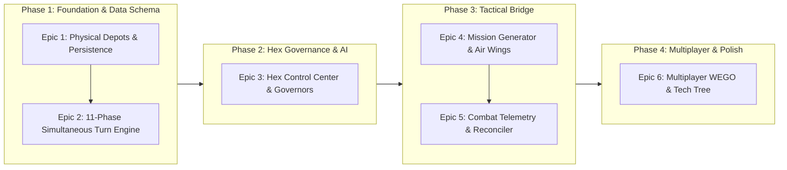

# GitHub Stories & Delivery Roadmap: Sea Power Theater Command

## Milestone Overview

---

## Epic 1: Worldwide Hex Data Schema & Persistent Logistics

- **Story 1.1: Physical Resource Depots & 5-Turn Capture Engine**
  - Track physical fuel, munitions, and ore depots per hex.
  - Transfer ownership after 5 uncontested occupation turns; freeze extraction when contested.
- **Story 1.2: Persistent Unit State (Component Damage & Ammo Bins)**
  - Persist discrete hull integrity, propulsion, radar, and weapon bins across battles.
  - Permanently remove destroyed units from the database.
- **Story 1.3: Real Estate Registry & Land/Water Detection**
  - Enable construction of munitions plants, refineries, and airbases with automatic GIS polygon land/water validation.
- **Story 1.4: Physical Trade Convoys & Interception Dynamics**
  - Spawn physical cargo flotillas along sea routes that can be interdicted by submarines and naval strike bombers.

---

## Epic 2: 11-Phase Simultaneous Turn Engine (WEGO)

- **Story 2.1: Turn Phase Orchestrator**
  - Execute the 11-phase turn loop deterministically with structured turn ledger summaries.
- **Story 2.2: National Military Market**
  - Provide a foreign surplus catalog to purchase Cold War vessels and aircraft with delivery turn delays.
- **Story 2.3: Diplomatic Treaties & Ceasefire Expiration**
  - Track turn-bound diplomatic treaties (ceasefires, tributes, non-aggression pacts) and transition stances on expiry.
- **Story 2.4: Regional Investment & Infrastructure Upgrades**
  - Allow direct treasury investment into hexes to boost production multipliers and revenue capacity.

---

## Epic 3: Hex Management & Autonomous Governors

- **Story 3.1: Hex Quick-View & Interactive Control Modal**
  - Create unified React dashboard displaying overview, units, construction queue, and governor policies.
- **Story 3.2: Formation Tactical Orders Palette (Move, Fortify, Refit, Split/Merge)**
  - Support direct tactical orders and transferring individual vessels between task forces.
- **Story 3.3: Autonomous Governor AI & Policy Presets**
  - Implement 6 autonomous AI governor policies (Wealth, Industry, Extraction, Tech, Warmonger, Balanced) to manage hexes without micro-management.

---

## Epic 4: Tactical Bridge & Procedural Mission Generator

- **Story 4.1: Airbase Strike Range Intersector**
  - Calculate operational radius from nearby friendly airbases to allocate air wings and CAP escorts to tactical missions.
- **Story 4.2: Realistic Approach Vector & Ingress/Egress Zone Placement**
  - Generate Sea Power [Zone] objects along boundary vectors (SW, NE) and create safe egress zones for land-based planes.
- **Story 4.3: Real Estate Static Asset Placement in Missions**
  - Place factories, fuel tanks, and radar masts from the hex as targetable 3D entities in generated Sea Power .ini missions.
- **Story 4.4: Deterministic Auto-Resolve Engine**
  - Provide Lanchester-based auto-resolution for minor skirmishes without launching Sea Power.

---

## Epic 5: Combat Telemetry & State Reconciliation

- **Story 5.1: Real-Time UDP Telemetry Listener & Save File Parser**
  - Capture weapon release, damage, and unit kill events directly from Sea Power runtime stream or save debriefs.
- **Story 5.2: Battle Aftermath Reconciler (Munitions, XP & Morale)**
  - Deduct expended missiles/fuel, award crew veterancy XP, and adjust morale based on battle outcome.
- **Story 5.3: Time-Bound Mission Continuation & Mid-Battle Resume**
  - Preserve final coordinates from 30-minute engagements so subsequent sorties resume from the exact frontline.

---

## Epic 6: Multiplayer Foundations & Platform Polish

- **Story 6.1: Asynchronous Turn Queue & Simultaneous Resolution**
  - Support multi-player sessions where turns advance simultaneously once all participants submit orders.
- **Story 6.2: Anti-Cheat Hash Verification for Battle Reports**
  - Validate mission seed checksums and debrief logs against tampering in competitive multiplayer.
- **Story 6.3: Mission Directory & File-Drop Helper**
  - Allow direct export of generated .ini missions into Sea Power StreamingAssets directory with one click.
- **Story 6.4: Cold War Tech Tree & Research Progression**
  - Implement research tree with weapon and sensor modernization branches (Aegis, Harpoon, Towed Sonar).
